# Database Documentation

## Entity-Relationship Diagram

```mermaid
erDiagram
    activities {
        UUID id PK
        UUID actor_id FK
        VARCHAR21 activity_type
        VARCHAR255 title
        TEXT description
        UUID target_id
        VARCHAR50 target_type
        JSON metadata
        VARCHAR100 icon
        VARCHAR30 color
        DATETIME created_at
    }
    applications {
        UUID id PK
        UUID applicant_id FK
        UUID project_id FK
        UUID flare_id FK
        VARCHAR9 status
        TEXT message
        VARCHAR500 portfolio_url
        VARCHAR500 github_url
        VARCHAR500 resume_url
        TEXT review_notes
        BOOLEAN shortlisted
        DATETIME created_at
        DATETIME updated_at
    }
    audit_logs {
        UUID id PK
        UUID user_id FK
        VARCHAR21 action
        VARCHAR100 resource_type
        VARCHAR100 resource_id
        TEXT description
        VARCHAR64 ip_address
        VARCHAR512 user_agent
        VARCHAR10 request_method
        VARCHAR500 request_path
        BOOLEAN success
        INTEGER status_code
        TEXT error_message
        DATETIME created_at
    }
    bookmarks {
        UUID id PK
        UUID user_id FK
        UUID project_id FK
        DATETIME created_at
    }
    bookmark_collections {
        UUID id PK
        UUID user_id FK
        VARCHAR100 name
        BOOLEAN is_default
        DATETIME created_at
        DATETIME updated_at
    }
    collection_bookmarks {
        UUID id PK
        UUID collection_id FK
        UUID bookmark_id FK
        DATETIME added_at
    }
    builder_flares {
        UUID id PK
        UUID project_id FK
        UUID created_by FK
        VARCHAR200 title
        TEXT description
        VARCHAR100 role
        VARCHAR150 location
        VARCHAR100 commitment
        VARCHAR100 experience_level
        INTEGER openings
        INTEGER applicants_count
        VARCHAR6 status
        BOOLEAN featured
        BOOLEAN remote
        DATETIME created_at
        DATETIME updated_at
    }
    conversations {
        UUID id PK
        VARCHAR7 type
        VARCHAR255 title
        UUID project_id FK
        UUID created_by FK
        BOOLEAN is_active
        BOOLEAN archived
        DATETIME created_at
        DATETIME updated_at
    }
    conversation_members {
        UUID id PK
        UUID conversation_id FK
        UUID user_id FK
        VARCHAR6 role
        BOOLEAN is_muted
        BOOLEAN is_archived
        DATETIME joined_at
        DATETIME last_read_at
        DATETIME created_at
        DATETIME updated_at
    }
    followers {
        UUID id PK
        UUID follower_id FK
        UUID following_id FK
        DATETIME created_at
    }
    messages {
        UUID id PK
        UUID conversation_id FK
        UUID sender_id FK
        UUID parent_message_id FK
        VARCHAR6 type
        TEXT content
        VARCHAR500 attachment_url
        VARCHAR255 attachment_name
        INTEGER attachment_size
        VARCHAR100 mime_type
        BOOLEAN is_edited
        BOOLEAN is_deleted
        DATETIME created_at
        DATETIME updated_at
        DATETIME edited_at
        DATETIME deleted_at
    }
    notifications {
        UUID id PK
        UUID recipient_id FK
        UUID sender_id FK
        VARCHAR20 type
        VARCHAR255 title
        TEXT message
        VARCHAR500 action_url
        VARCHAR500 image_url
        UUID project_id FK
        UUID conversation_id FK
        UUID message_id FK
        UUID application_id FK
        BOOLEAN is_read
        DATETIME read_at
        DATETIME created_at
        DATETIME updated_at
    }
    organizations {
        UUID id PK
        UUID owner_id FK
        VARCHAR200 name
        VARCHAR200 slug
        TEXT description
        VARCHAR11 organization_type
        VARCHAR500 website
        VARCHAR255 email
        VARCHAR50 phone
        VARCHAR500 logo_url
        VARCHAR500 banner_url
        VARCHAR200 location
        VARCHAR500 github_url
        VARCHAR500 linkedin_url
        VARCHAR500 twitter_url
        INTEGER members_count
        INTEGER projects_count
        INTEGER followers_count
        BOOLEAN verified
        BOOLEAN hiring
        BOOLEAN active
        DATETIME created_at
        DATETIME updated_at
    }
    organization_members {
        UUID id PK
        UUID organization_id FK
        UUID user_id FK
        VARCHAR6 role
        BOOLEAN is_active
        DATETIME joined_at
        DATETIME created_at
        DATETIME updated_at
    }
    projects {
        UUID id PK
        UUID owner_id FK
        VARCHAR200 title
        VARCHAR200 slug
        VARCHAR255 tagline
        TEXT description
        VARCHAR10 stage
        VARCHAR7 visibility
        TEXT tech_stack
        JSON tags
        VARCHAR500 repository_url
        VARCHAR500 website_url
        VARCHAR500 demo_url
        INTEGER team_size
        INTEGER max_team_size
        BOOLEAN hiring
        VARCHAR500 logo_url
        VARCHAR500 banner_url
        INTEGER stars
        INTEGER views
        INTEGER applications_count
        BOOLEAN is_featured
        BOOLEAN is_archived
        DATETIME scheduled_publish_at
        BOOLEAN is_published
        DATETIME created_at
        DATETIME updated_at
    }
    project_members {
        UUID id PK
        UUID project_id FK
        UUID user_id FK
        VARCHAR10 role
        BOOLEAN is_active
        DATETIME joined_at
        DATETIME created_at
        DATETIME updated_at
    }
    project_skills {
        UUID id PK
        UUID project_id FK
        UUID skill_id FK
        BOOLEAN required
        INTEGER minimum_experience
        DATETIME created_at
        DATETIME updated_at
    }
    refresh_tokens {
        UUID id PK
        UUID user_id FK
        VARCHAR512 token
        VARCHAR255 device_name
        VARCHAR100 device_type
        VARCHAR100 browser
        VARCHAR100 operating_system
        VARCHAR64 ip_address
        VARCHAR512 user_agent
        BOOLEAN is_revoked
        DATETIME expires_at
        DATETIME revoked_at
        DATETIME last_used_at
        DATETIME created_at
        DATETIME updated_at
    }
    repositories {
        UUID id PK
        UUID project_id FK
        UUID connected_by FK
        VARCHAR9 provider
        VARCHAR100 repository_id
        VARCHAR100 owner
        VARCHAR150 name
        VARCHAR255 full_name
        TEXT description
        VARCHAR50 default_branch
        VARCHAR500 clone_url
        VARCHAR500 html_url
        VARCHAR500 homepage
        VARCHAR100 language
        INTEGER stars
        INTEGER forks
        INTEGER watchers
        INTEGER open_issues
        INTEGER contributors
        BOOLEAN is_private
        BOOLEAN archived
        BOOLEAN synced
        DATETIME last_synced_at
        DATETIME created_at
        DATETIME updated_at
    }
    skills {
        UUID id PK
        VARCHAR100 name
        VARCHAR100 normalized_name
        VARCHAR100 slug
        VARCHAR100 category
        VARCHAR255 description
        VARCHAR255 icon
        DATETIME created_at
        DATETIME updated_at
    }
    users {
        UUID id PK
        VARCHAR100 first_name
        VARCHAR100 last_name
        VARCHAR50 username
        VARCHAR255 email
        VARCHAR255 password_hash
        JSON badges
        VARCHAR150 headline
        TEXT bio
        VARCHAR500 profile_image
        VARCHAR500 cover_image
        VARCHAR150 location
        VARCHAR100 timezone
        JSON availability
        VARCHAR255 website
        VARCHAR500 resume_url
        VARCHAR255 portfolio_url
        VARCHAR255 public_email
        VARCHAR255 github_url
        VARCHAR255 linkedin_url
        VARCHAR100 role
        VARCHAR50 experience_level
        VARCHAR150 company
        BOOLEAN open_to_work
        BOOLEAN is_active
        BOOLEAN is_verified
        BOOLEAN is_superuser
        DATETIME email_verified_at
        DATETIME last_login
        DATETIME last_seen
        DATETIME last_active_at
        VARCHAR100 github_id
        VARCHAR100 google_id
        DATETIME created_at
        DATETIME updated_at
    }
    user_skills {
        UUID id PK
        UUID user_id FK
        UUID skill_id FK
        VARCHAR12 level
        INTEGER years_of_experience
        DATETIME created_at
        DATETIME updated_at
    }
    user_reports {
        UUID id PK
        UUID reporter_id FK
        UUID reported_id FK
        VARCHAR100 reason
        TEXT description
        VARCHAR50 status
        DATETIME created_at
    }
    activities }o--|| users : "actor_id references id"
    applications }o--|| users : "applicant_id references id"
    applications }o--|| projects : "project_id references id"
    applications }o--|| builder_flares : "flare_id references id"
    audit_logs }o--|| users : "user_id references id"
    bookmarks }o--|| users : "user_id references id"
    bookmarks }o--|| projects : "project_id references id"
    bookmark_collections }o--|| users : "user_id references id"
    collection_bookmarks }o--|| bookmark_collections : "collection_id references id"
    collection_bookmarks }o--|| bookmarks : "bookmark_id references id"
    builder_flares }o--|| projects : "project_id references id"
    builder_flares }o--|| users : "created_by references id"
    conversations }o--|| projects : "project_id references id"
    conversations }o--|| users : "created_by references id"
    conversation_members }o--|| conversations : "conversation_id references id"
    conversation_members }o--|| users : "user_id references id"
    followers }o--|| users : "follower_id references id"
    followers }o--|| users : "following_id references id"
    messages }o--|| conversations : "conversation_id references id"
    messages }o--|| users : "sender_id references id"
    messages }o--|| messages : "parent_message_id references id"
    notifications }o--|| users : "recipient_id references id"
    notifications }o--|| users : "sender_id references id"
    notifications }o--|| projects : "project_id references id"
    notifications }o--|| conversations : "conversation_id references id"
    notifications }o--|| messages : "message_id references id"
    notifications }o--|| applications : "application_id references id"
    organizations }o--|| users : "owner_id references id"
    organization_members }o--|| organizations : "organization_id references id"
    organization_members }o--|| users : "user_id references id"
    projects }o--|| users : "owner_id references id"
    project_members }o--|| projects : "project_id references id"
    project_members }o--|| users : "user_id references id"
    project_skills }o--|| projects : "project_id references id"
    project_skills }o--|| skills : "skill_id references id"
    refresh_tokens }o--|| users : "user_id references id"
    repositories }o--|| projects : "project_id references id"
    repositories }o--|| users : "connected_by references id"
    user_skills }o--|| users : "user_id references id"
    user_skills }o--|| skills : "skill_id references id"
    user_reports }o--|| users : "reporter_id references id"
    user_reports }o--|| users : "reported_id references id"
```

## Tables
### activities

| Column | Type | Nullable | Primary Key | Foreign Key |
|---|---|---|---|---|
| id | UUID | False | True |  |
| actor_id | UUID | False | False | users.id |
| activity_type | VARCHAR(21) | False | False |  |
| title | VARCHAR(255) | False | False |  |
| description | TEXT | True | False |  |
| target_id | UUID | True | False |  |
| target_type | VARCHAR(50) | True | False |  |
| metadata | JSON | False | False |  |
| icon | VARCHAR(100) | True | False |  |
| color | VARCHAR(30) | True | False |  |
| created_at | DATETIME | False | False |  |

#### Indexes
| Name | Columns | Unique |
|---|---|---|
| ix_activities_target_type | target_type | False |
| ix_activities_activity_type | activity_type | False |
| ix_activities_target_id | target_id | False |
| ix_activities_actor_id | actor_id | False |
| ix_activities_type_created | activity_type, created_at | False |
| ix_activities_created_at | created_at | False |

### applications

| Column | Type | Nullable | Primary Key | Foreign Key |
|---|---|---|---|---|
| id | UUID | False | True |  |
| applicant_id | UUID | False | False | users.id |
| project_id | UUID | False | False | projects.id |
| flare_id | UUID | False | False | builder_flares.id |
| status | VARCHAR(9) | False | False |  |
| message | TEXT | True | False |  |
| portfolio_url | VARCHAR(500) | True | False |  |
| github_url | VARCHAR(500) | True | False |  |
| resume_url | VARCHAR(500) | True | False |  |
| review_notes | TEXT | True | False |  |
| shortlisted | BOOLEAN | False | False |  |
| created_at | DATETIME | False | False |  |
| updated_at | DATETIME | False | False |  |

#### Indexes
| Name | Columns | Unique |
|---|---|---|
| ix_applications_project_id | project_id | False |
| ix_applications_created_at | created_at | False |
| ix_applications_status | status | False |
| ix_applications_flare_id | flare_id | False |
| ix_applications_applicant_id | applicant_id | False |

### audit_logs

| Column | Type | Nullable | Primary Key | Foreign Key |
|---|---|---|---|---|
| id | UUID | False | True |  |
| user_id | UUID | True | False | users.id |
| action | VARCHAR(21) | False | False |  |
| resource_type | VARCHAR(100) | False | False |  |
| resource_id | VARCHAR(100) | True | False |  |
| description | TEXT | True | False |  |
| ip_address | VARCHAR(64) | True | False |  |
| user_agent | VARCHAR(512) | True | False |  |
| request_method | VARCHAR(10) | True | False |  |
| request_path | VARCHAR(500) | True | False |  |
| success | BOOLEAN | False | False |  |
| status_code | INTEGER | True | False |  |
| error_message | TEXT | True | False |  |
| created_at | DATETIME | False | False |  |

#### Indexes
| Name | Columns | Unique |
|---|---|---|
| ix_audit_logs_user_id | user_id | False |
| ix_audit_logs_action | action | False |
| ix_audit_logs_success | success | False |
| ix_audit_logs_created_at | created_at | False |

### bookmarks

| Column | Type | Nullable | Primary Key | Foreign Key |
|---|---|---|---|---|
| id | UUID | False | True |  |
| user_id | UUID | False | False | users.id |
| project_id | UUID | False | False | projects.id |
| created_at | DATETIME | False | False |  |

#### Indexes
| Name | Columns | Unique |
|---|---|---|
| ix_bookmarks_user_id | user_id | False |
| ix_bookmarks_project_id | project_id | False |

### bookmark_collections

| Column | Type | Nullable | Primary Key | Foreign Key |
|---|---|---|---|---|
| id | UUID | False | True |  |
| user_id | UUID | False | False | users.id |
| name | VARCHAR(100) | False | False |  |
| is_default | BOOLEAN | False | False |  |
| created_at | DATETIME | False | False |  |
| updated_at | DATETIME | False | False |  |

#### Indexes
| Name | Columns | Unique |
|---|---|---|
| ix_bookmark_collections_user_id | user_id | False |

### collection_bookmarks

| Column | Type | Nullable | Primary Key | Foreign Key |
|---|---|---|---|---|
| id | UUID | False | True |  |
| collection_id | UUID | False | False | bookmark_collections.id |
| bookmark_id | UUID | False | False | bookmarks.id |
| added_at | DATETIME | False | False |  |

#### Indexes
| Name | Columns | Unique |
|---|---|---|
| ix_collection_bookmarks_collection_id | collection_id | False |
| ix_collection_bookmarks_bookmark_id | bookmark_id | False |

### builder_flares

| Column | Type | Nullable | Primary Key | Foreign Key |
|---|---|---|---|---|
| id | UUID | False | True |  |
| project_id | UUID | False | False | projects.id |
| created_by | UUID | False | False | users.id |
| title | VARCHAR(200) | False | False |  |
| description | TEXT | False | False |  |
| role | VARCHAR(100) | False | False |  |
| location | VARCHAR(150) | True | False |  |
| commitment | VARCHAR(100) | True | False |  |
| experience_level | VARCHAR(100) | True | False |  |
| openings | INTEGER | False | False |  |
| applicants_count | INTEGER | False | False |  |
| status | VARCHAR(6) | False | False |  |
| featured | BOOLEAN | False | False |  |
| remote | BOOLEAN | False | False |  |
| created_at | DATETIME | False | False |  |
| updated_at | DATETIME | False | False |  |

#### Indexes
| Name | Columns | Unique |
|---|---|---|
| ix_builder_flares_status | status | False |
| ix_builder_flares_created_at | created_at | False |
| ix_builder_flares_project_id | project_id | False |
| ix_builder_flares_created_by | created_by | False |
| ix_builder_flares_featured | featured | False |

### conversations

| Column | Type | Nullable | Primary Key | Foreign Key |
|---|---|---|---|---|
| id | UUID | False | True |  |
| type | VARCHAR(7) | False | False |  |
| title | VARCHAR(255) | True | False |  |
| project_id | UUID | True | False | projects.id |
| created_by | UUID | False | False | users.id |
| is_active | BOOLEAN | False | False |  |
| archived | BOOLEAN | False | False |  |
| created_at | DATETIME | False | False |  |
| updated_at | DATETIME | False | False |  |

#### Indexes
| Name | Columns | Unique |
|---|---|---|
| ix_conversations_project_id | project_id | False |
| ix_conversations_created_by | created_by | False |

### conversation_members

| Column | Type | Nullable | Primary Key | Foreign Key |
|---|---|---|---|---|
| id | UUID | False | True |  |
| conversation_id | UUID | False | False | conversations.id |
| user_id | UUID | False | False | users.id |
| role | VARCHAR(6) | False | False |  |
| is_muted | BOOLEAN | False | False |  |
| is_archived | BOOLEAN | False | False |  |
| joined_at | DATETIME | False | False |  |
| last_read_at | DATETIME | True | False |  |
| created_at | DATETIME | False | False |  |
| updated_at | DATETIME | False | False |  |

#### Indexes
| Name | Columns | Unique |
|---|---|---|
| ix_conversation_members_conversation_id | conversation_id | False |
| ix_conversation_members_user_id | user_id | False |

### followers

| Column | Type | Nullable | Primary Key | Foreign Key |
|---|---|---|---|---|
| id | UUID | False | True |  |
| follower_id | UUID | False | False | users.id |
| following_id | UUID | False | False | users.id |
| created_at | DATETIME | False | False |  |

#### Indexes
| Name | Columns | Unique |
|---|---|---|
| ix_followers_following_id | following_id | False |
| ix_followers_follower_id | follower_id | False |

### messages

| Column | Type | Nullable | Primary Key | Foreign Key |
|---|---|---|---|---|
| id | UUID | False | True |  |
| conversation_id | UUID | False | False | conversations.id |
| sender_id | UUID | False | False | users.id |
| parent_message_id | UUID | True | False | messages.id |
| type | VARCHAR(6) | False | False |  |
| content | TEXT | False | False |  |
| attachment_url | VARCHAR(500) | True | False |  |
| attachment_name | VARCHAR(255) | True | False |  |
| attachment_size | INTEGER | True | False |  |
| mime_type | VARCHAR(100) | True | False |  |
| is_edited | BOOLEAN | False | False |  |
| is_deleted | BOOLEAN | False | False |  |
| created_at | DATETIME | False | False |  |
| updated_at | DATETIME | False | False |  |
| edited_at | DATETIME | True | False |  |
| deleted_at | DATETIME | True | False |  |

#### Indexes
| Name | Columns | Unique |
|---|---|---|
| ix_messages_created_at | created_at | False |
| ix_messages_conversation_id | conversation_id | False |
| ix_messages_parent_message_id | parent_message_id | False |
| ix_messages_sender_id | sender_id | False |

### notifications

| Column | Type | Nullable | Primary Key | Foreign Key |
|---|---|---|---|---|
| id | UUID | False | True |  |
| recipient_id | UUID | False | False | users.id |
| sender_id | UUID | True | False | users.id |
| type | VARCHAR(20) | False | False |  |
| title | VARCHAR(255) | False | False |  |
| message | TEXT | False | False |  |
| action_url | VARCHAR(500) | True | False |  |
| image_url | VARCHAR(500) | True | False |  |
| project_id | UUID | True | False | projects.id |
| conversation_id | UUID | True | False | conversations.id |
| message_id | UUID | True | False | messages.id |
| application_id | UUID | True | False | applications.id |
| is_read | BOOLEAN | False | False |  |
| read_at | DATETIME | True | False |  |
| created_at | DATETIME | False | False |  |
| updated_at | DATETIME | False | False |  |

#### Indexes
| Name | Columns | Unique |
|---|---|---|
| ix_notifications_sender_id | sender_id | False |
| ix_notifications_created_at | created_at | False |
| ix_notifications_recipient_id | recipient_id | False |
| ix_notifications_is_read | is_read | False |

### organizations

| Column | Type | Nullable | Primary Key | Foreign Key |
|---|---|---|---|---|
| id | UUID | False | True |  |
| owner_id | UUID | False | False | users.id |
| name | VARCHAR(200) | False | False |  |
| slug | VARCHAR(200) | False | False |  |
| description | TEXT | True | False |  |
| organization_type | VARCHAR(11) | False | False |  |
| website | VARCHAR(500) | True | False |  |
| email | VARCHAR(255) | True | False |  |
| phone | VARCHAR(50) | True | False |  |
| logo_url | VARCHAR(500) | True | False |  |
| banner_url | VARCHAR(500) | True | False |  |
| location | VARCHAR(200) | True | False |  |
| github_url | VARCHAR(500) | True | False |  |
| linkedin_url | VARCHAR(500) | True | False |  |
| twitter_url | VARCHAR(500) | True | False |  |
| members_count | INTEGER | False | False |  |
| projects_count | INTEGER | False | False |  |
| followers_count | INTEGER | False | False |  |
| verified | BOOLEAN | False | False |  |
| hiring | BOOLEAN | False | False |  |
| active | BOOLEAN | False | False |  |
| created_at | DATETIME | False | False |  |
| updated_at | DATETIME | False | False |  |

#### Indexes
| Name | Columns | Unique |
|---|---|---|
| ix_organizations_slug | slug | True |
| ix_organizations_owner_id | owner_id | False |

### organization_members

| Column | Type | Nullable | Primary Key | Foreign Key |
|---|---|---|---|---|
| id | UUID | False | True |  |
| organization_id | UUID | False | False | organizations.id |
| user_id | UUID | False | False | users.id |
| role | VARCHAR(6) | False | False |  |
| is_active | BOOLEAN | False | False |  |
| joined_at | DATETIME | False | False |  |
| created_at | DATETIME | False | False |  |
| updated_at | DATETIME | False | False |  |

#### Indexes
| Name | Columns | Unique |
|---|---|---|
| ix_organization_members_organization_id | organization_id | False |
| ix_organization_members_user_id | user_id | False |

### projects

| Column | Type | Nullable | Primary Key | Foreign Key |
|---|---|---|---|---|
| id | UUID | False | True |  |
| owner_id | UUID | False | False | users.id |
| title | VARCHAR(200) | False | False |  |
| slug | VARCHAR(200) | False | False |  |
| tagline | VARCHAR(255) | True | False |  |
| description | TEXT | False | False |  |
| stage | VARCHAR(10) | False | False |  |
| visibility | VARCHAR(7) | False | False |  |
| tech_stack | TEXT | True | False |  |
| tags | JSON | True | False |  |
| repository_url | VARCHAR(500) | True | False |  |
| website_url | VARCHAR(500) | True | False |  |
| demo_url | VARCHAR(500) | True | False |  |
| team_size | INTEGER | False | False |  |
| max_team_size | INTEGER | False | False |  |
| hiring | BOOLEAN | False | False |  |
| logo_url | VARCHAR(500) | True | False |  |
| banner_url | VARCHAR(500) | True | False |  |
| stars | INTEGER | False | False |  |
| views | INTEGER | False | False |  |
| applications_count | INTEGER | False | False |  |
| is_featured | BOOLEAN | False | False |  |
| is_archived | BOOLEAN | False | False |  |
| scheduled_publish_at | DATETIME | True | False |  |
| is_published | BOOLEAN | False | False |  |
| created_at | DATETIME | False | False |  |
| updated_at | DATETIME | False | False |  |

#### Indexes
| Name | Columns | Unique |
|---|---|---|
| ix_projects_is_published | is_published | False |
| ix_projects_owner_id | owner_id | False |
| ix_projects_is_featured | is_featured | False |
| ix_projects_stage | stage | False |
| ix_projects_scheduled_publish_at | scheduled_publish_at | False |
| ix_projects_slug | slug | True |
| ix_projects_created_at | created_at | False |
| ix_projects_is_archived | is_archived | False |

### project_members

| Column | Type | Nullable | Primary Key | Foreign Key |
|---|---|---|---|---|
| id | UUID | False | True |  |
| project_id | UUID | False | False | projects.id |
| user_id | UUID | False | False | users.id |
| role | VARCHAR(10) | False | False |  |
| is_active | BOOLEAN | False | False |  |
| joined_at | DATETIME | False | False |  |
| created_at | DATETIME | False | False |  |
| updated_at | DATETIME | False | False |  |

#### Indexes
| Name | Columns | Unique |
|---|---|---|
| ix_project_members_user_id | user_id | False |
| ix_project_members_project_id | project_id | False |

### project_skills

| Column | Type | Nullable | Primary Key | Foreign Key |
|---|---|---|---|---|
| id | UUID | False | True |  |
| project_id | UUID | False | False | projects.id |
| skill_id | UUID | False | False | skills.id |
| required | BOOLEAN | False | False |  |
| minimum_experience | INTEGER | False | False |  |
| created_at | DATETIME | False | False |  |
| updated_at | DATETIME | False | False |  |

#### Indexes
| Name | Columns | Unique |
|---|---|---|
| ix_project_skills_skill_id | skill_id | False |
| ix_project_skills_project_id | project_id | False |

### refresh_tokens

| Column | Type | Nullable | Primary Key | Foreign Key |
|---|---|---|---|---|
| id | UUID | False | True |  |
| user_id | UUID | False | False | users.id |
| token | VARCHAR(512) | False | False |  |
| device_name | VARCHAR(255) | True | False |  |
| device_type | VARCHAR(100) | True | False |  |
| browser | VARCHAR(100) | True | False |  |
| operating_system | VARCHAR(100) | True | False |  |
| ip_address | VARCHAR(64) | True | False |  |
| user_agent | VARCHAR(512) | True | False |  |
| is_revoked | BOOLEAN | False | False |  |
| expires_at | DATETIME | False | False |  |
| revoked_at | DATETIME | True | False |  |
| last_used_at | DATETIME | True | False |  |
| created_at | DATETIME | False | False |  |
| updated_at | DATETIME | False | False |  |

#### Indexes
| Name | Columns | Unique |
|---|---|---|
| ix_refresh_tokens_token | token | True |
| ix_refresh_tokens_user_id | user_id | False |

### repositories

| Column | Type | Nullable | Primary Key | Foreign Key |
|---|---|---|---|---|
| id | UUID | False | True |  |
| project_id | UUID | False | False | projects.id |
| connected_by | UUID | True | False | users.id |
| provider | VARCHAR(9) | False | False |  |
| repository_id | VARCHAR(100) | True | False |  |
| owner | VARCHAR(100) | False | False |  |
| name | VARCHAR(150) | False | False |  |
| full_name | VARCHAR(255) | False | False |  |
| description | TEXT | True | False |  |
| default_branch | VARCHAR(50) | False | False |  |
| clone_url | VARCHAR(500) | True | False |  |
| html_url | VARCHAR(500) | False | False |  |
| homepage | VARCHAR(500) | True | False |  |
| language | VARCHAR(100) | True | False |  |
| stars | INTEGER | False | False |  |
| forks | INTEGER | False | False |  |
| watchers | INTEGER | False | False |  |
| open_issues | INTEGER | False | False |  |
| contributors | INTEGER | False | False |  |
| is_private | BOOLEAN | False | False |  |
| archived | BOOLEAN | False | False |  |
| synced | BOOLEAN | False | False |  |
| last_synced_at | DATETIME | True | False |  |
| created_at | DATETIME | False | False |  |
| updated_at | DATETIME | False | False |  |

#### Indexes
| Name | Columns | Unique |
|---|---|---|
| ix_repositories_project_id | project_id | False |
| ix_repositories_connected_by | connected_by | False |

### skills

| Column | Type | Nullable | Primary Key | Foreign Key |
|---|---|---|---|---|
| id | UUID | False | True |  |
| name | VARCHAR(100) | False | False |  |
| normalized_name | VARCHAR(100) | False | False |  |
| slug | VARCHAR(100) | False | False |  |
| category | VARCHAR(100) | True | False |  |
| description | VARCHAR(255) | True | False |  |
| icon | VARCHAR(255) | True | False |  |
| created_at | DATETIME | False | False |  |
| updated_at | DATETIME | False | False |  |

#### Indexes
| Name | Columns | Unique |
|---|---|---|
| ix_skills_normalized_name | normalized_name | True |
| ix_skills_slug | slug | True |

### users

| Column | Type | Nullable | Primary Key | Foreign Key |
|---|---|---|---|---|
| id | UUID | False | True |  |
| first_name | VARCHAR(100) | False | False |  |
| last_name | VARCHAR(100) | False | False |  |
| username | VARCHAR(50) | False | False |  |
| email | VARCHAR(255) | False | False |  |
| password_hash | VARCHAR(255) | False | False |  |
| badges | JSON | False | False |  |
| headline | VARCHAR(150) | True | False |  |
| bio | TEXT | True | False |  |
| profile_image | VARCHAR(500) | True | False |  |
| cover_image | VARCHAR(500) | True | False |  |
| location | VARCHAR(150) | True | False |  |
| timezone | VARCHAR(100) | True | False |  |
| availability | JSON | True | False |  |
| website | VARCHAR(255) | True | False |  |
| resume_url | VARCHAR(500) | True | False |  |
| portfolio_url | VARCHAR(255) | True | False |  |
| public_email | VARCHAR(255) | True | False |  |
| github_url | VARCHAR(255) | True | False |  |
| linkedin_url | VARCHAR(255) | True | False |  |
| role | VARCHAR(100) | True | False |  |
| experience_level | VARCHAR(50) | True | False |  |
| company | VARCHAR(150) | True | False |  |
| open_to_work | BOOLEAN | False | False |  |
| is_active | BOOLEAN | False | False |  |
| is_verified | BOOLEAN | False | False |  |
| is_superuser | BOOLEAN | False | False |  |
| email_verified_at | DATETIME | True | False |  |
| last_login | DATETIME | True | False |  |
| last_seen | DATETIME | True | False |  |
| last_active_at | DATETIME | True | False |  |
| github_id | VARCHAR(100) | True | False |  |
| google_id | VARCHAR(100) | True | False |  |
| created_at | DATETIME | False | False |  |
| updated_at | DATETIME | False | False |  |

#### Indexes
| Name | Columns | Unique |
|---|---|---|
| ix_users_is_verified | is_verified | False |
| ix_users_email | email | True |
| ix_users_is_active | is_active | False |
| ix_users_username | username | True |

### user_skills

| Column | Type | Nullable | Primary Key | Foreign Key |
|---|---|---|---|---|
| id | UUID | False | True |  |
| user_id | UUID | False | False | users.id |
| skill_id | UUID | False | False | skills.id |
| level | VARCHAR(12) | False | False |  |
| years_of_experience | INTEGER | False | False |  |
| created_at | DATETIME | False | False |  |
| updated_at | DATETIME | False | False |  |

#### Indexes
| Name | Columns | Unique |
|---|---|---|
| ix_user_skills_skill_id | skill_id | False |
| ix_user_skills_user_id | user_id | False |

### user_reports

| Column | Type | Nullable | Primary Key | Foreign Key |
|---|---|---|---|---|
| id | UUID | False | True |  |
| reporter_id | UUID | False | False | users.id |
| reported_id | UUID | False | False | users.id |
| reason | VARCHAR(100) | False | False |  |
| description | TEXT | True | False |  |
| status | VARCHAR(50) | False | False |  |
| created_at | DATETIME | False | False |  |
